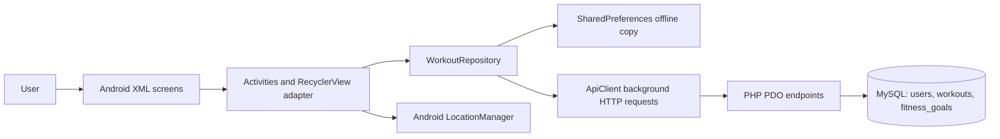
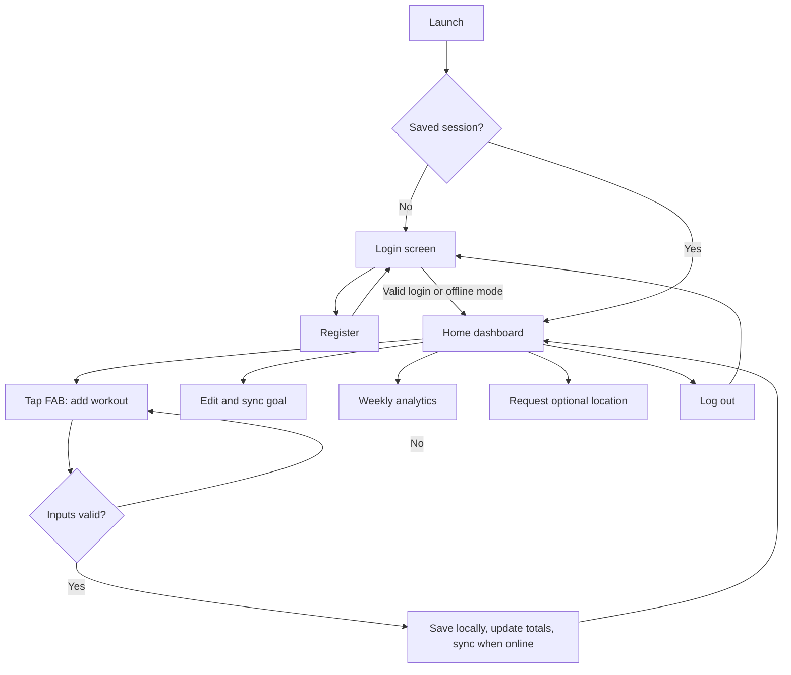

# Mobile App Development [2182-1]

## Building a Fitness Tracking Application: BlushFit

**Student name:** [INSERT FULL NAME]  
**NCC Education student number:** [INSERT STUDENT NUMBER]  
**Centre:** [INSERT CENTRE]  
**Submission date:** [INSERT DATE]  
**Approximate word count:** [UPDATE AFTER EDITING]

> Submission note: replace every square-bracketed placeholder, add your own screenshots, check the required word limit, apply justified double spacing in Microsoft Word, and put your name and student number in the header. Read and adapt the report so it accurately reflects your own understanding and development process.

## Introduction

This report explains the planning, design and development of BlushFit, a native Android fitness tracking application. The application lets a user register or log in, record running, cycling, weightlifting and yoga sessions, attach an optional location, set a daily calorie goal, review daily totals and inspect seven-day analytics. Workout information is saved locally so the core app remains demonstrable without a network. When a PHP/MySQL server is available, authenticated user workouts and goals are also stored centrally.

The project was implemented in Kotlin using Android Studio conventions and XML layouts. The server side uses PHP PDO and MySQL. The visual design uses a pastel pink and cream palette to address the chosen audience while maintaining readable typography, conventional controls and clear feedback.

# Task 1: Understanding the Scope and Position of Mobile Apps

## 1(a) Key characteristics of mobile apps

Mobile apps are designed for portable, personal and sensor-rich devices. Their interfaces must work with touch input, intermittent connectivity, limited power and many screen configurations. Unlike a desktop website, an installed app can use operating-system services such as location, notifications and local storage, subject to permission and privacy controls.

**Touch-based interaction.** BlushFit uses large Material buttons, a FloatingActionButton for the main “add workout” action, scrollable cards and a RecyclerView. These controls reduce typing and make the most common action reachable. The add-workout dialog uses a spinner for activity selection and numeric fields for duration and calories. This is faster and less error-prone than requiring a user to type an activity name.

**Offline accessibility.** Mobile connectivity may be slow, expensive or unavailable. The app therefore reads and writes a local SharedPreferences copy first. A user choosing “Continue offline” can add workouts, calculate progress and inspect analytics without a server. Android’s offline-first guidance states that an offline-first application should at minimum be able to read important data without network access (Android Developers, 2026a). The current prototype meets this minimum and immediately displays local data. A production version would improve reliability further with Room and a durable synchronization queue using WorkManager.

**Personalisation and analytics.** Mobile apps can turn frequent personal input into useful feedback. BlushFit totals calories and estimated running steps for the current day, compares calories with the user’s goal, groups minutes by activity and identifies the leading activity over seven days. The personal insight encourages progress towards 150 weekly active minutes. This is consistent with the WHO recommendation that adults undertake 150–300 minutes of moderate-intensity aerobic activity per week (World Health Organization, 2020), although the app makes clear that its output is motivational rather than medical advice.

**Location and sensors.** The app requests location only after the user presses “Use my location”. It retrieves one location rather than continuously tracking in the background. This is appropriate for attaching context to a workout and reduces battery use. Location accuracy varies according to the available provider, permissions and request settings (Android Developers, 2026b). A future route-tracking mode would require timed updates, a foreground service and clear privacy controls.

**Notifications.** A production fitness app could use push or scheduled notifications to remind users to exercise, log a completed session or celebrate a goal. Notifications should be optional, appropriately timed and user controlled. They should not expose sensitive fitness information on a lock screen without consent. BlushFit does not require notifications for its core assessment workflow, but a reminder feature is identified as a future enhancement.

**Immediate feedback.** After a workout is added, the RecyclerView, calorie total, estimated steps and goal progress are updated immediately. A toast reports whether the change was saved offline or synchronized. Validation prevents zero or missing duration and calorie values. This feedback helps the user understand the outcome of each action.

## 1(b) Scope and limitations

The scope of mobile fitness applications includes manual workout journals, activity recognition, GPS route recording, wearable integration, nutrition, coaching, social challenges and long-term health trends. BlushFit focuses on manual logging and understandable analytics. This scope is achievable for a Level 5 project and avoids presenting sensor estimates as clinical measurements.

There are several limitations:

1. **Device and OS compatibility.** Android devices use different OS versions and vendor customisations. BlushFit supports API level 24 and above, but behaviour such as permissions and background execution can differ. Testing should cover at least a small phone, a modern phone and a larger tablet or resizable emulator.
2. **Screen size and orientation.** Phones, foldables and tablets have different available window sizes. Android recommends adaptive layouts that reflow instead of simply stretching controls (Android Developers, 2026c). The current ScrollView and weighted rows avoid clipping on ordinary phones. A commercial version should add width-qualified resources or a two-pane layout for tablets.
3. **Battery consumption.** Frequent high-accuracy GPS updates increase power use. Android documentation explains that greater accuracy and frequency normally consume more battery (Android Developers, 2026d). BlushFit therefore requests a single foreground location. Continuous route tracking would need balanced accuracy, sensible intervals and explicit start/stop controls.
4. **Sensor accuracy.** GPS can be inaccurate indoors or among tall buildings, while accelerometer-derived steps vary by device and movement. The current “steps” value is explicitly an estimate based on logged running minutes, not a hardware pedometer reading.
5. **Connectivity and synchronization.** A local write can succeed while server synchronization fails. The prototype keeps local data and informs the user, but a production application should mark records as pending and retry safely without creating duplicates.
6. **Privacy and security.** Location and fitness records are personal. Passwords are hashed in PHP and SQL commands are parameterised, but the development server uses HTTP on the emulator. Android warns that cleartext communication can be intercepted or changed (Android Developers, 2026e). Deployment must use HTTPS/TLS, secure server credentials, authentication tokens, access controls and a privacy notice.
7. **Medical limitations.** Calories and insights are estimates and must not be described as diagnosis or treatment. Users with health concerns should rely on qualified professionals and validated devices.

## 1(c) Developing for multiple platforms

Supporting Android and iOS introduces differences in languages, SDKs, interface conventions, permissions, background processing, maps, notifications, signing and store review. Even when business rules are shared, platform-specific testing remains necessary. An iOS user expects Apple navigation conventions while an Android user expects Android back behaviour and Material components.

Three strategies are possible. Separate native applications provide maximum platform integration but duplicate development. A cross-platform framework shares more code but may need native modules for specialised sensors. A shared API with native clients keeps server behaviour consistent while each client uses its platform’s preferred UI. For a small Android-focused assessment, native Kotlin is the lowest-risk choice. If BlushFit later targets iOS, the PHP API and database could remain shared while an iOS client is developed in Swift, or the client could be rebuilt with a maintained cross-platform framework.

# Task 2: Architectures, Platforms, Languages and Tools

## 2(a) Key characteristics of native apps

A native Android app is compiled for Android and directly uses Android SDK APIs. BlushFit is native because its activities, RecyclerView, permissions and LocationManager integration are implemented in Kotlin against Android libraries.

The main advantages are performance, direct API access, predictable Android behaviour and strong tooling. RecyclerView efficiently reuses card views, the Activity Result API handles runtime permission responses, and Kotlin interoperates with Java-based Android libraries. Google describes Android development as Kotlin-first because Kotlin is concise, expressive and helps reduce common errors (Android Developers, 2026f). Native development is particularly suitable when location, sensors, foreground services or Health Connect require timely platform support.

Disadvantages include platform lock-in and duplicated effort if an iOS version is needed. Android-only Kotlin developers may not have Swift expertise. Separate codebases can cause features and bug fixes to arrive at different times. Device fragmentation also requires testing across API levels, display sizes and manufacturers.

## 2(b) Cross-platform frameworks

**React Native** uses JavaScript or TypeScript with React concepts while rendering native components. It offers a large ecosystem and can share user interface and business logic across Android and iOS. React Native supports platform-specific files and a Platform API where behaviour differs (React Native, 2026a). Native Modules and Fabric components allow access to Kotlin, Java, Swift, Objective-C or C++ code (React Native, 2026b). These bridges make sensor integration possible but add complexity, dependency risk and native build knowledge. Performance can be good, but animation or computation on the JavaScript thread may require optimisation (React Native, 2026c).

**Xamarin** historically allowed C# and .NET code sharing with native Android and iOS bindings. However, Microsoft ended Xamarin support in May 2024 and directs projects towards .NET MAUI (Microsoft, 2024). Therefore, beginning a new 2026 project in Xamarin would create maintenance and security risks. .NET MAUI is the relevant successor for teams already invested in C# and .NET.

For BlushFit, React Native could reduce effort for a future iOS client, but native modules might still be required for advanced location or health integrations. .NET MAUI would be attractive to a C# team, but less suitable for the current Kotlin/Android learning outcomes. Native Kotlin remains the strongest fit for this assignment because only Android is required and direct demonstration of Android components is assessed.

## 2(c) Current trends in development tools

**Integrated development environments.** Android Studio is the official Android IDE and combines a Gradle build system, emulator, profilers, layout inspection, lint and testing tools (Android Developers, 2026g). Current Android development increasingly uses Kotlin and Jetpack Compose. Compose is the modern declarative toolkit, although XML remains supported and offers clear separation between presentation and behaviour (Android Developers, 2026h). BlushFit deliberately uses XML because the assignment requests XML and because RecyclerView/CardView demonstrate the required View components.

**Version control and collaboration.** Git records changes and permits earlier versions to be restored. As a distributed version-control system, every clone can contain the full history, reducing dependence on one working copy (Chacon and Straub, 2014). A suitable workflow uses a protected main branch, short feature branches, meaningful commits and review before merging. Secrets such as production database passwords must not be committed.

**Automated testing and continuous integration.** Modern teams run unit, integration and UI tests on each change. Android’s testing guidance identifies faster feedback, earlier failure detection and safer refactoring as major benefits (Android Developers, 2026i). Local JUnit tests in BlushFit verify that `WorkoutFactory` creates the correct subclasses and preserves values. The command `gradlew testDebugUnitTest assembleDebug` runs the tests and creates the APK. Future Espresso tests should automate login validation, adding a workout and opening analytics. A CI service could run these tasks whenever code is pushed.

**Architecture and offline data.** Recommended Android architecture separates UI and data responsibilities and exposes data through repositories (Android Developers, 2026j). BlushFit uses `WorkoutRepository` to isolate local storage and API synchronization from activities. For a larger app, ViewModels, StateFlow, Room and dependency injection would improve lifecycle handling and testability.

## 2(d) Native versus cross-platform evaluation

| Factor | Native Kotlin | Cross-platform |
|---|---|---|
| Time to first Android release | Fast for an Android-skilled team | Framework setup may add overhead |
| Android performance | Direct and predictable | Usually good, but bridges/runtime may add cost |
| GPS and Android APIs | Immediate SDK access | May depend on packages or native modules |
| Android UI quality | Natural Material behaviour | Requires platform-aware design |
| Android and iOS code sharing | Low | High for supported features |
| Maintenance | One platform for this brief | One shared layer plus platform exceptions |
| Team skills | Kotlin/Android required | JavaScript/React or C#/.NET plus native knowledge |

Native Kotlin was selected because Android is the assessed platform, geolocation is required, and the project must demonstrate Android-specific UI classes. Cross-platform development becomes more attractive if iOS delivery and a shared team are added to the business requirements. The decision is therefore contextual rather than claiming that one approach is universally superior.

# Task 3: Planning and Designing the Mobile Application

## 3(a) SDLC application

An iterative SDLC was used:

1. **Requirements analysis:** Requirements were extracted from the brief: authentication, running/cycling/weightlifting input, RecyclerView, FAB, geolocation, MySQL/PHP storage, goals, statistics and OOP. Security, offline use and usability were recorded as non-functional requirements.
2. **Design:** The screens, data entities, colour palette, navigation and client-server architecture were planned. A simple repository separates UI from storage. The database was normalised into users, workouts and fitness goals.
3. **Implementation:** XML layouts and Kotlin activities were created first, followed by local persistence, calculations, location permission handling and PHP endpoints. Yoga and seven-day insights were added as higher-grade extensions.
4. **Testing:** Inputs, offline operation and calculations were checked manually. Gradle compiled the complete project, and JUnit factory tests were added. The final debug build and unit tests completed successfully.
5. **Deployment:** The debug APK can be installed on an emulator or Android device. The PHP folder is deployed beneath an Apache document root and `database.sql` is imported into MySQL. Production deployment would use HTTPS and environment-managed secrets.
6. **Maintenance:** Likely future work includes Room-based synchronization, token authentication, push reminders, route distance, wearable integration, accessibility testing and adaptive tablet layouts.

Iteration was valuable because building the basic workout list exposed additional needs such as offline demonstration, server record IDs and server-side deletion. Each was added and then rebuilt rather than being deferred until the end.

## 3(b) Specification and design

### Functional requirements

- Register with a name, email and password.
- Log in through the PHP service or continue offline for demonstration.
- Display daily steps estimate, calories and goal completion.
- Add Running, Cycling, Weightlifting or Yoga with duration and calories.
- Optionally attach the device’s current latitude and longitude.
- Display workouts in a RecyclerView with activity-specific presentation.
- Delete a workout using a confirmed long press.
- Set and synchronize a daily calorie goal.
- Show seven-day totals, active days, activity breakdown and an insight.
- Retain critical data locally and synchronize available server data.

### Non-functional requirements

- Simple touch interaction and clear validation.
- Consistent pastel styling and readable contrast.
- Responsive scrolling on phone-sized displays.
- Prepared SQL statements and hashed passwords.
- No network operation on the Android main thread.
- Maintainable Kotlin classes with straightforward naming and comments.
- Minimum Android API 24 and target API 35.

### Input and output data

| Data | Type and validation | Use |
|---|---|---|
| Name | Required text | Greeting/account identity |
| Email | Valid email, unique in MySQL | Login identifier |
| Password | Minimum six characters; stored as hash | Authentication |
| Activity type | Controlled list | Workout classification |
| Duration | Positive integer minutes | Totals and insights |
| Calories | Positive integer | Daily progress |
| Date | `YYYY-MM-DD` | Daily and weekly grouping |
| Coordinates | Optional decimal latitude/longitude | Workout context |
| Calorie goal | Integer 1–10,000 | Daily goal progress |

### System architecture



The repository is the central data access point. It provides immediate local behaviour and hides HTTP details from the UI. PHP validates input and uses parameterised PDO statements. Foreign keys ensure that workouts and goals belong to valid users and are removed if a user is deleted.

### Interaction flow



### Wireframes

```text
LOGIN                         HOME
+----------------------+     +---------------------------+
| Welcome to BlushFit  |     | Hello, Beautiful!         |
| Email                |     | [Use location] [Log out]  |
| Password             |     | +-----------------------+ |
| [ Log in ]           |     | | Steps | Calories      | |
| Create account       |     | | Goal progress         | |
| [Continue offline]   |     | | [Weekly insights]     | |
+----------------------+     | +-----------------------+ |
                             | Today's workouts         |
                             | [Running card]           |
                             | [Cycling card]        [+]|
                             +---------------------------+

ANALYTICS
+---------------------------+
| Weekly insights           |
| Minutes | Calories | Days |
| Running         =====     |
| Cycling         ===       |
| Weightlifting   ====      |
| Yoga            ==        |
| Personal insight          |
+---------------------------+
```

### Design justification

The cream background (`#FFF0F3`) provides a soft base while rose (`#FF6584`) marks important actions and progress. White summary surfaces separate information without excessive borders. Activity cards use distinct pastel fills plus text and emoji labels, so colour is not the only identifier. The FAB represents the dominant action. Less frequent actions—goal editing, insights, location and logout—use text or outlined buttons.

XML was chosen to satisfy the requested implementation and to keep layout separate from Kotlin logic. Android confirms that XML layouts separate presentation from behavioural code and can support different screen resources (Android Developers, 2026h). The main screen uses a NestedScrollView so content remains reachable on smaller screens. RecyclerView nested scrolling is disabled because the outer page performs the scrolling.

# Task 4: Developing Application Functionality

## 4(a) Android Studio

The project follows the standard Gradle Android structure. `settings.gradle.kts` declares the app module, while `app/build.gradle.kts` defines API levels, Kotlin/JVM compatibility and AndroidX dependencies. `AndroidManifest.xml` registers activities and internet/location permissions. The Gradle wrapper makes builds reproducible. A verified command produced `app-debug.apk` successfully.

## 4(b) User-interface elements and functionality

The required RecyclerView is implemented by `WorkoutAdapter`, which binds a `Workout` to `item_workout.xml` and reuses ViewHolder objects. The FloatingActionButton opens a validated dialog. MainActivity recalculates totals after every add or delete. Location uses a runtime permission request and a single update from GPS or network provider. AnalyticsActivity filters records from the previous seven days, computes totals and shows a personalised message. Long-press deletion includes confirmation to reduce accidental data loss.

Evidence to insert before submission:

- [SCREENSHOT: Login screen]
- [SCREENSHOT: Main screen showing RecyclerView and FAB]
- [SCREENSHOT: Add-workout dialog with validation]
- [SCREENSHOT: Location permission and displayed coordinates]
- [SCREENSHOT: Weekly analytics]
- [SCREENSHOT: Successful Gradle build and tests]
- [SCREENSHOT: phpMyAdmin users, workouts and fitness_goals tables]

## 4(c) Database

MySQL contains three related tables. `users` stores a unique email and password hash. `workouts` stores activity, duration, calories, date and optional coordinates with a foreign key to users. `fitness_goals` uses `user_id` as its primary and foreign key, creating a one-to-one current-goal relationship.

PHP endpoints support registration, login, add/list/delete workout and save/get goal. PDO exception mode is enabled, emulated prepares are disabled and every user value is supplied through a prepared statement. Passwords use `password_hash()` and `password_verify()`. Deletion includes both workout ID and user ID so one user cannot delete another user’s record merely by guessing an ID.

For local emulator testing, `10.0.2.2` reaches Apache on the development computer. This HTTP exception is development-only. A release must use HTTPS, remove cleartext permission, move database credentials out of source code and replace repeated passwords with expiring authenticated sessions or tokens.

### Test plan and results

| ID | Test | Expected result | Result |
|---|---|---|---|
| T01 | Build debug APK | Gradle completes and APK exists | Pass |
| T02 | Run JUnit tests | All factory tests pass | Pass |
| T03 | Submit blank login | Validation message shown | Pass |
| T04 | Register valid new account | Hashed account added to MySQL | [ADD RESULT/SCREENSHOT] |
| T05 | Use wrong password | Login rejected without revealing details | [ADD RESULT] |
| T06 | Continue offline | Dashboard opens without server | Pass |
| T07 | Add valid Running workout | Card appears and totals increase | Pass |
| T08 | Add zero/blank values | Dialog remains open with error | Pass |
| T09 | Grant location | Coordinates shown and attached | [ADD DEVICE RESULT] |
| T10 | Deny location | App remains usable and explains denial | [ADD DEVICE RESULT] |
| T11 | Change daily goal | Progress recalculates and goal syncs | [ADD SERVER RESULT] |
| T12 | Long-press workout | Confirmation appears; confirmed item removed | Pass |
| T13 | Open analytics | Seven-day totals and breakdown displayed | Pass |
| T14 | Restart app | Local workouts remain available | Pass |
| T15 | Rotate and test tablet size | No clipped controls or crash | [ADD RESULT] |

# Task 5: Employing Object-Oriented Techniques

## 5(a) Object orientation in Kotlin and Android

Object-oriented programming groups state and behaviour into classes. **Encapsulation** keeps implementation details behind methods. For example, `WorkoutRepository` owns SharedPreferences and network synchronization; activities request operations instead of editing stored JSON directly. `SessionManager` similarly owns session keys.

**Inheritance** creates a specialised class from a general class. Kotlin classes are final by default, so the base `Workout` is explicitly marked `open`. Running, Cycling, Weightlifting and Yoga inherit common fields while overriding the icon. The Kotlin language model supports one direct class superclass and multiple interfaces (Kotlin Foundation, 2026).

**Polymorphism** allows the adapter and repository to use the base `Workout` type while runtime objects provide specialised behaviour. `WorkoutAdapter` can display a mixed `List<Workout>` and obtain the correct overridden icon without separate lists or unsafe casting.

**Abstraction** is demonstrated by Android framework base classes. Activities use lifecycle callbacks without implementing the operating system’s complete window-management logic. RecyclerView.Adapter defines the operations an adapter must provide while RecyclerView handles recycling and scrolling.

These principles reduce duplication and localise change. Adding Yoga required a subclass and one factory branch; common duration, calorie, date, location, serialization and adapter behaviour remained reusable.

## 5(b) Three inheritance examples

### Example 1: Workout activity hierarchy

`RunningWorkout`, `CyclingWorkout`, `WeightliftingWorkout` and `YogaWorkout` inherit from `Workout`. The parent encapsulates shared values and JSON conversion. Each child overrides `icon`. This prevents four copies of common properties and lets `WorkoutFactory` return a polymorphic `Workout`. If another activity is introduced, it can reuse the same repository and adapter contract.

### Example 2: Android activities

`LoginActivity`, `RegisterActivity`, `MainActivity` and `AnalyticsActivity` inherit from `AppCompatActivity`. They reuse Android lifecycle, theme, resource, window and navigation behaviour. Each overrides `onCreate()` to provide screen-specific setup. This is maintainable because common platform behaviour remains in the framework superclass while each screen contains only its own UI logic.

### Example 3: RecyclerView adapter and ViewHolder

`WorkoutAdapter` inherits from `RecyclerView.Adapter<WorkoutViewHolder>`, while its nested holder inherits from `RecyclerView.ViewHolder`. The adapter overrides `onCreateViewHolder`, `onBindViewHolder` and `getItemCount`. RecyclerView can therefore call a standard polymorphic interface without knowing BlushFit’s card details. View recycling improves performance and avoids manually creating a long list of views.

Together these examples demonstrate inheritance for domain modelling, application lifecycle and reusable UI infrastructure. Inheritance was used where a genuine “is-a” relationship exists; composition was preferred for services such as repository and session management.

# Conclusion

BlushFit meets the core scenario through a native Android interface, required RecyclerView/FAB/geolocation components, local operation, PHP/MySQL authentication and workout storage. The extended Yoga option, synchronized goals, ownership-checked deletion and weekly personalised analytics go beyond the minimum three-activity list. The architecture remains understandable for an academic project while demonstrating separation of concerns and OOP.

The main production limitations are development-only HTTP, basic session handling, SharedPreferences rather than a transactional offline database, and limited adaptive/device testing. Addressing these through HTTPS, token authentication, Room/WorkManager, accessibility checks and tablet layouts would be the next development iteration.

# Reference list

Android Developers (2026a) *Build an offline-first app*. Available at: https://developer.android.com/topic/architecture/data-layer/offline-first (Accessed: 4 October 2026).

Android Developers (2026b) *Request location updates*. Available at: https://developer.android.com/develop/sensors-and-location/location/request-updates (Accessed: 4 October 2026).

Android Developers (2026c) *Adapt layouts*. Available at: https://developer.android.com/design/ui/mobile/guides/layout-and-content/adapt-layout (Accessed: 4 October 2026).

Android Developers (2026d) *About background location and battery life*. Available at: https://developer.android.com/develop/sensors-and-location/location/battery (Accessed: 4 October 2026).

Android Developers (2026e) *Cleartext communications*. Available at: https://developer.android.com/privacy-and-security/risks/cleartext-communications (Accessed: 4 October 2026).

Android Developers (2026f) *Android’s Kotlin-first approach*. Available at: https://developer.android.com/kotlin/first (Accessed: 4 October 2026).

Android Developers (2026g) *Meet Android Studio*. Available at: https://developer.android.com/studio/intro (Accessed: 4 October 2026).

Android Developers (2026h) *Layouts in views*. Available at: https://developer.android.com/develop/ui/views/layout/declaring-layout (Accessed: 4 October 2026).

Android Developers (2026i) *Test apps on Android*. Available at: https://developer.android.com/training/testing (Accessed: 4 October 2026).

Android Developers (2026j) *Recommendations for Android architecture*. Available at: https://developer.android.com/topic/architecture/recommendations (Accessed: 4 October 2026).

Chacon, S. and Straub, B. (2014) *Pro Git*. 2nd edn. New York: Apress. Available at: https://git-scm.com/book/en/v2 (Accessed: 4 October 2026).

Kotlin Foundation (2026) *Kotlin language specification: inheritance*. Available at: https://kotlinlang.org/spec/pdf/sections/inheritance.pdf (Accessed: 4 October 2026).

Microsoft (2024) *Upgrade from Xamarin to .NET*. Available at: https://learn.microsoft.com/en-us/dotnet/maui/get-started/migrate (Accessed: 4 October 2026).

React Native (2026a) *Platform-specific code*. Available at: https://reactnative.dev/docs/platform-specific-code (Accessed: 4 October 2026).

React Native (2026b) *Native Platform*. Available at: https://reactnative.dev/docs/native-platform (Accessed: 4 October 2026).

React Native (2026c) *Performance overview*. Available at: https://reactnative.dev/docs/performance (Accessed: 4 October 2026).

World Health Organization (2020) *WHO guidelines on physical activity and sedentary behaviour*. Geneva: World Health Organization. Available at: https://iris.who.int/bitstream/handle/10665/336656/9789240015128-eng.pdf (Accessed: 4 October 2026).

# Appendix A: Main source-code evidence

- `app/src/main/java/com/example/fitnessapp/MainActivity.kt`
- `app/src/main/java/com/example/fitnessapp/AnalyticsActivity.kt`
- `app/src/main/java/com/example/fitnessapp/WorkoutAdapter.kt`
- `app/src/main/java/com/example/fitnessapp/model/Workout.kt`
- `app/src/main/java/com/example/fitnessapp/data/WorkoutRepository.kt`
- `app/src/main/java/com/example/fitnessapp/network/ApiClient.kt`
- `app/src/main/res/layout/activity_main.xml`
- `backend/database.sql`
- `backend/register.php`, `login.php`, `add_workout.php`, `get_workouts.php`
- `backend/delete_workout.php`, `save_goal.php`, `get_goal.php`

# Appendix B: Build evidence

Command used:

```text
gradlew.bat --no-daemon testDebugUnitTest assembleDebug
```

Verified result on 4 October 2026:

```text
BUILD SUCCESSFUL
39 actionable tasks: 2 executed, 37 up-to-date
```

Generated APK: `app/build/outputs/apk/debug/app-debug.apk`
